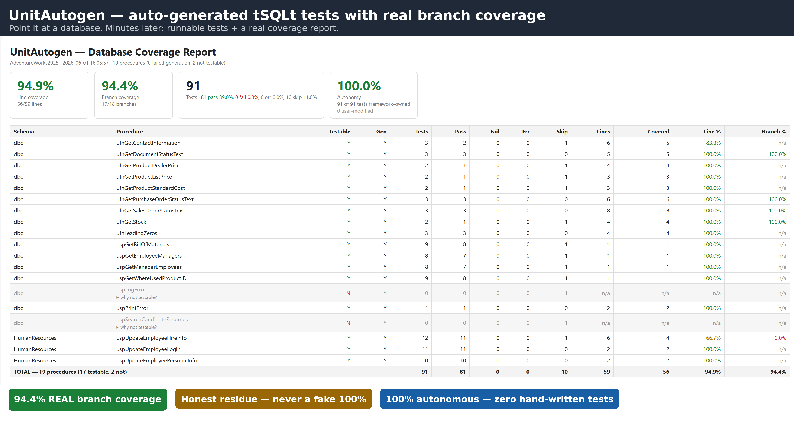
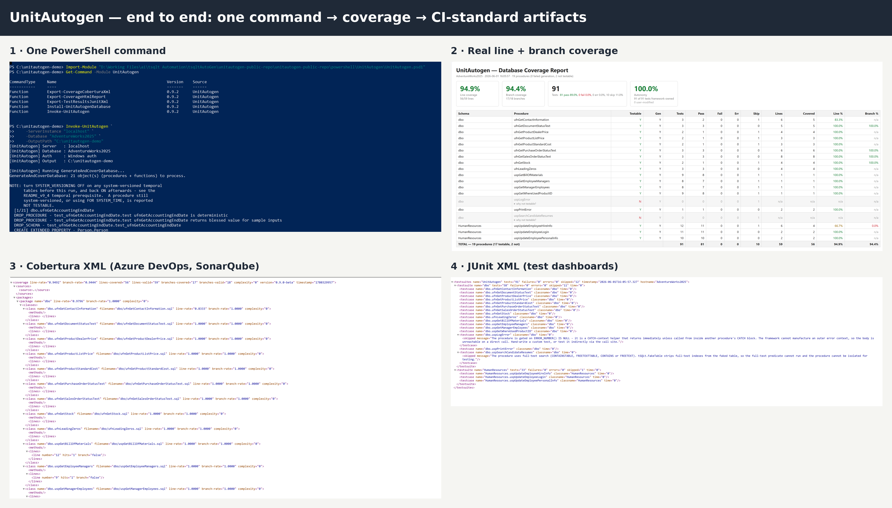
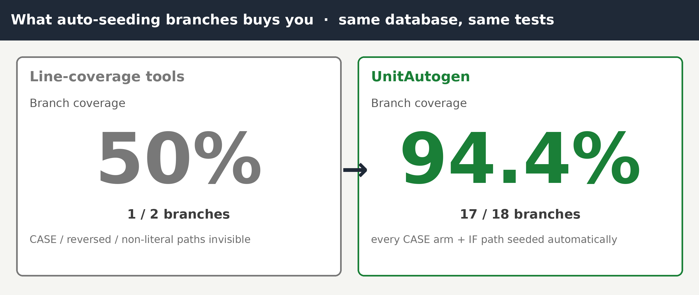

# UnitAutogen

> **Built on tSQLt — auto-generated unit tests with real branch coverage.**



UnitAutogen is a framework for SQL Server that **reads a stored procedure, generates a complete tSQLt unit-test class for it, and reports real line *and* branch coverage** of the test run. Point it at a procedure; minutes later you have a runnable test class that exercises every IF / CASE / EXISTS path and a coverage report that tells you what was actually hit.

It is built on top of the open-source [tSQLt](https://tsqlt.org) framework. The tests it generates run under tSQLt and produce tSQLt-native results.

---

**Website:** [unitautogen.com](https://unitautogen.com) · **Status: Beta** — see [Releases](https://github.com/unitautogen/unitautogen-public-repo/releases) for the current version, or install the latest from the [PowerShell Gallery](https://www.powershellgallery.com/packages/UnitAutogen).
Validated end-to-end against AdventureWorks, Northwind, and WideWorldImporters. Expect rough edges on production schemas it hasn't seen. See [docs/what-works.md](docs/what-works.md) for the honest scope.

---

## See it in action

One command generates the tests, runs them, measures coverage, and emits the CI-standard artifacts your pipeline already understands — Cobertura (coverage), JUnit (test results), and a human-readable HTML report:



---

## Why it exists

The SQL Server testing ecosystem already has unit-testing frameworks (tSQLt, Redgate SQL Test, Devart dbForge Unit Test) and coverage tools (SQLCover, SQLServerCoverage). Every one of them assumes a human has already written the tests. **UnitAutogen is the missing front half.** It writes the tests, runs them, and measures real branch coverage — converting "we should write tests for these 200 legacy procs" from a person-months task into an afternoon's curation.



## How it works: reverse predicate seeding

Mocking a table is the easy half — and on its own it isn't enough. `tSQLt.FakeTable` hands you an **empty** table, which only ever exercises the "no rows" arm of a branch. To reach the *other* arm, someone has to insert rows that actually satisfy the procedure's conditions. Every other tool leaves that to you.

UnitAutogen does it automatically. It parses each branch predicate — `WHERE`, `IF` / `CASE`, `JOIN` / `EXISTS` / `NOT EXISTS`, aggregate gates (`COUNT` / `SUM` / `MIN` / `MAX`), `OR` / DNF compositions, `NULL` checks, parameter comparisons — and works **backwards** from it to synthesize the exact seed rows that drive that branch to a chosen direction, both the TRUE and the FALSE side.

```sql
-- a gate inside your procedure:
IF (SELECT COUNT(*) FROM Sales.Orders WHERE CustomerID = @CustomerID) > 5
    ...
```

Faking `Sales.Orders` gives you an empty table, so you only ever hit the `<= 5` arm (~50% branch coverage). UnitAutogen reads the gate and manufactures two seeds — one with 6 matching orders to drive the `> 5` arm, one with fewer to drive the `<= 5` arm — so **both** branches run. Every seed carries a **strong assertion** that it actually drove the predicate the intended way, so a wrong seed fails loudly instead of ghost-passing.

That reverse step — deriving satisfying data from arbitrary T-SQL (joins, aggregates, DNF, `NULL` semantics, local-variable data-flow) — is the hard part, and it's what turns "we faked the table" into "we exercised the branch." When a direction genuinely can't be satisfied (a contradiction, an unreachable arm), it's reported as `NOT_TESTABLE` with the reason — never faked into a pass.

## Requirements

- SQL Server 2017 (MSSQL14) or later
- tSQLt **v1.0.7597.5637 (Oct 2020) or later** installed in the target database (`SELECT tSQLt.Info();` to check)
- Permissions: `CREATE PROCEDURE`, `CREATE FUNCTION`, `CREATE SCHEMA` on the target database

## Quick start

Run these in SSMS from the repo root. The two install files are each
self-contained, so the simplest path is to just **open each `.sql` file in SSMS and
press F5** — no SQLCMD Mode needed. The script below uses `:r` includes purely as a
convenience; for those, turn on **SQLCMD Mode** first (Query → SQLCMD Mode).

```sql
-- 1. Install the framework into your database (idempotent; safe to re-run)
USE YourDatabase;
GO
:r Install_UnitAutogen.sql

-- 1b. Register the single in-database (SQLCLR) predicate parser.
--     Needs sysadmin once + 'clr enabled' = 1. (Run clr\Install-UnitAutogenClr.SSMS.sql
--     directly in SSMS if you're not in SQLCMD mode.)
:r clr\Install-UnitAutogenClr.SSMS.sql

-- 2. Parse predicates (fills TestGen.PredicateInbox for data-shape branch seeding)
EXEC TestGen.ParseDatabasePredicates @SchemaFilter = N'dbo';   -- or NULL/'*' = all schemas

-- 3. Generate, run, and report coverage for ONE procedure - one call
EXEC TestGen.GenerateAndRunCoverage
     @SchemaName = N'dbo',
     @ProcName   = N'YourProcedure',
     @OutputMode = N'HTML';     -- or N'TEXT'

-- 4. Or do it for the WHOLE database in one call (CI/CD entry point)
EXEC TestGen.GenerateAndCoverDatabase
     @OutputMode = N'HTML';
```

That's the entire happy path. The two procedures above generate the test
classes, run them, and print a coverage report - line and branch percentages
plus a list of any uncovered lines.

## CI/CD Integration

UnitAutogen emits **Cobertura XML** (coverage) and **JUnit XML** (test results)
natively consumed by Azure DevOps, GitHub Actions, Jenkins, GitLab CI, and SonarQube —
no custom plugins required.

**PowerShell wrapper — one call exports all three output files:**

```powershell
Import-Module './powershell/UnitAutogen.psm1'   # auto-installs SqlServer module

Invoke-UnitAutogen `
    -ServerInstance 'sql01' `
    -Database       'YourDatabase' `
    -OutputPath     './artifacts'

# Writes:
#   artifacts/coverage.xml          ← Cobertura XML for coverage tools
#   artifacts/test-results.xml      ← JUnit XML for test result dashboards
#   artifacts/coverage-report.html  ← Human-readable HTML report
```

Or call the SQL procs directly from SSMS:

```sql
EXEC TestGen.GenerateAndCoverDatabase @OutputMode = 'COBERTURA';  -- Cobertura XML
EXEC TestGen.GetCoverageCoberturaXml;   -- re-export without re-running
EXEC TestGen.GetTestResultsJunitXml;    -- JUnit XML
EXEC TestGen.GetCoverageHtmlReport;     -- HTML report
```

Ready-to-use pipeline files are in the [`ci/`](ci/) folder:
[`ci/azure-pipelines.yml`](ci/azure-pipelines.yml) and
[`ci/github-actions.yml`](ci/github-actions.yml).

### Azure DevOps Pipelines task

Prefer a first-class pipeline step over a script block? UnitAutogen ships an
**Azure Pipelines task** — add a single `UnitAutogenCoverage@0` step that runs
generation + coverage and emits Cobertura + JUnit + HTML for the native
**Publish Code Coverage Results** / **Publish Test Results** tasks:

```yaml
- task: UnitAutogenCoverage@0
  inputs:
    serverInstance: 'sql01'
    database: 'YourDatabase'
    schemaFilter: 'dbo'
```

Source and the package/publish guide are in
[`azure-devops-extension/`](azure-devops-extension/) (it publishes to the
Visual Studio Marketplace — the Azure DevOps tab).

Full usage guide: [`powershell/USAGE.md`](powershell/USAGE.md).

## Documentation

| Document                                          | When to read it                                                                                |
|---------------------------------------------------|------------------------------------------------------------------------------------------------|
| [docs/quickstart.md](docs/quickstart.md)          | First 15 minutes - install, generate, see a coverage report.                                   |
| [docs/EASY_USAGE.md](docs/EASY_USAGE.md)          | The four commands that cover 80% of normal usage. Start here after the quickstart.             |
| [docs/ADVANCED_USAGE.md](docs/ADVANCED_USAGE.md)  | Every user-facing method, every switch, the custom-test-class pattern.                         |
| [docs/REFERENCE_GUIDE.md](docs/REFERENCE_GUIDE.md)| Complete reference - every method, the coverage architecture, troubleshooting, feature history.|
| [docs/what-works.md](docs/what-works.md)          | Honest scope - what UnitAutogen handles well, partially, or not yet.                           |
| [docs/architecture.md](docs/architecture.md)      | How coverage instrumentation works under the hood.                                             |
| [docs/strong-assertions.md](docs/strong-assertions.md) | The snapshot-and-replay assertion mechanism for branch tests.                             |
| [docs/advanced-snippets.sql](docs/advanced-snippets.sql) | Paste-ready SQL for the advanced workflows above.                                        |
| [INSTALL.md](INSTALL.md)                          | Full installation options, upgrade paths, modular install.                                     |
| [powershell/USAGE.md](powershell/USAGE.md)        | PowerShell wrapper — CI/CD usage, Windows/SQL auth, Azure DevOps and GitHub Actions YAML.     |

## What works, what doesn't

Honest scope is in [docs/what-works.md](docs/what-works.md). Short version: UnitAutogen shines on procedural T-SQL with `IF` / `CASE` / `EXISTS` branching. Set-based / heavy CTE / dynamic-SQL procedures fall back to statement-level smoke coverage. NOT-TESTABLE procedures are detected and labelled rather than producing misleading 0% reports.

## How it works

In one paragraph: UnitAutogen parses your procedure body, builds a path table of every IF / CASE / EXISTS branch, generates a test per path with appropriate seed data, instruments a copy of the procedure with Extended Events line probes, runs the test class, captures hit lines from the XEvent file, and produces a line/branch coverage report. v9.4 added snapshot-and-replay assertions so each branch's table effect is verified, not just executed. v10 added universal generation, NOT-TESTABLE detection, and in-place test preservation across regenerations.

Full architecture: [docs/architecture.md](docs/architecture.md).

## Status and roadmap

This is the **first public release** of UnitAutogen, labelled Beta because real-world testing only happens at scale once strangers run it on their own schemas. The engineering has been validated on three reference databases at high coverage, but you will surface things on production schemas that nobody has tried. Bug reports are the most valuable thing you can give us right now.

**Shipped in this release:**

- Cobertura XML + JUnit XML output — natively consumed by Azure DevOps, GitHub Actions, Jenkins, GitLab CI, SonarQube
- HTML coverage report re-export without re-running tests
- PowerShell wrapper module (`UnitAutogen.psm1`) with Windows and SQL auth support
- Ready-to-use Azure DevOps and GitHub Actions pipeline YAML samples

**What's coming next (your input shapes the order):**

- Broader stored procedure pattern support (dynamic SQL, OUTPUT parameters, CLR)
- SonarQube quality gate integration guide
- NuGet package for easier pipeline consumption

## Contributing

See [CONTRIBUTING.md](CONTRIBUTING.md). External *code* contributions are not being accepted in Beta — but bug reports, feature suggestions, and feedback are essential and very welcome.

## Licence

UnitAutogen is licensed under the **GNU Affero General Public License v3.0** (see [`LICENSE`](LICENSE) and [`COPYRIGHT`](COPYRIGHT)).

A separate **commercial licence**, without the AGPL's copyleft obligations, is available for organisations that prefer it. Contact **licensing@unitautogen.com**.

## Support

- **Bug reports & feature requests:** [open an Issue](../../issues/new/choose) on this repository.
- **Questions / general:** open a Discussion, or email **hello@unitautogen.com**.
- **Security / vulnerability reports:** see [SECURITY.md](SECURITY.md) or email **security@unitautogen.com** privately.
- **Commercial licensing:** **licensing@unitautogen.com**.

## Acknowledgements

UnitAutogen builds on the excellent [tSQLt](https://tsqlt.org) framework by Sebastian Meine and the tSQLt project — without it, none of this works. The framework is developed and tested against Microsoft's [AdventureWorks](https://github.com/microsoft/sql-server-samples), [Northwind](https://github.com/microsoft/sql-server-samples), and [WideWorldImporters](https://github.com/microsoft/sql-server-samples) sample databases; gratitude to Microsoft for keeping those public.
