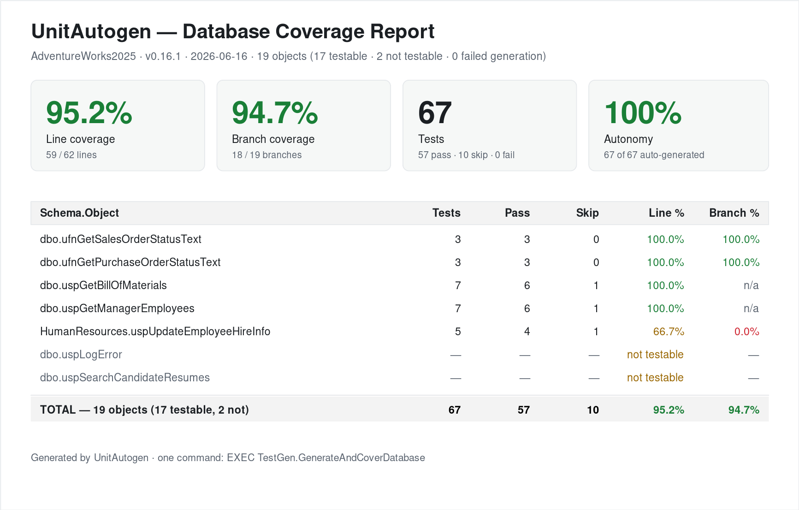

# Worked example: UnitAutogen end to end

This page shows UnitAutogen twice over, with real output:

1. **On a clean, unmodified AdventureWorks2025** — the actual full-database run and its HTML
   coverage report, so you can see how it does on real, stock procedures and functions it
   was never tuned for.
2. **Two procedures up close** — two small, purpose-built procedures shown in full, so you
   can read the exact tests UnitAutogen generated and the assertions inside them.

Everything below is real UnitAutogen v0.16.1 output, generated 2026-06-16.

---

## 1. A clean AdventureWorks2025 — one command, real coverage

Point it at a **stock, unmodified AdventureWorks2025** and run a single command:

```sql
EXEC TestGen.GenerateAndCoverDatabase @OutputMode = N'HTML';
```

It generates a tSQLt test class for every testable object, runs them all, measures line and
branch coverage, and writes an HTML report. Here is the actual result — full report:
[`reports/v0.16.1/Adventureworks2025.html`](../reports/v0.16.1/Adventureworks2025.html).



| Metric | Result |
|---|---|
| **Objects** | 19 (17 testable, 2 not — 0 failed generation) |
| **Tests** | 67 — 57 pass, 0 fail, 0 error, 10 skipped |
| **Line coverage** | **95.2%** (59 / 62) |
| **Branch coverage** | **94.7%** (18 / 19) |
| **Autonomy** | 100% — 67 of 67 tests framework-generated, 0 hand-edited |

A sample of the per-object grid (real AdventureWorks objects, verbatim from the report):

| Schema.Object | Tests | Pass | Skip | Line % | Branch % |
|---|---:|---:|---:|---:|---:|
| `dbo.ufnGetSalesOrderStatusText` | 3 | 3 | 0 | 100.0% | 100.0% |
| `dbo.ufnGetPurchaseOrderStatusText` | 3 | 3 | 0 | 100.0% | 100.0% |
| `dbo.uspGetBillOfMaterials` | 7 | 6 | 1 | 100.0% | n/a |
| `dbo.uspGetManagerEmployees` | 7 | 6 | 1 | 100.0% | n/a |
| `HumanResources.uspUpdateEmployeeHireInfo` | 5 | 4 | 1 | 66.7% | 0.0% |
| `dbo.uspLogError` | — | — | — | *not testable* | — |
| `dbo.uspSearchCandidateResumes` | — | — | — | *not testable* | — |
| **TOTAL — 19 objects** | **67** | **57** | **10** | **95.2%** | **94.7%** |

The two *not testable* rows are the honest part — and the report says **why**, in plain English:

- `dbo.uspLogError` — "a CATCH-context helper that returns immediately unless called from
  inside another procedure's CATCH block. The framework cannot manufacture an outer error
  context… Hand-write a custom test, or test it indirectly via the call site."
- `dbo.uspSearchCandidateResumes` — "uses full-text search (CONTAINSTABLE / FREETEXT).
  `tSQLt.FakeTable` strips full-text indexes from the faked table, so the procedure cannot be
  isolated."

Nothing is faked into a green pass — an object the framework can't honestly test is labelled,
not rounded up. (The same run on [Northwind](../reports/v0.16.1/Northwind.html) lands at 100% / 100%.)

---

## 2. Two procedures up close

The two procedures below are small, **purpose-built examples** — short enough to read in full,
chosen to show the two shapes that matter: a write with a branch, and branch-heavy logic with
an error path.

### 2a. `Production.uspUpsertProductInventory` → 100% line, 100% branch

**Definition**

```sql
CREATE OR ALTER PROCEDURE Production.uspUpsertProductInventory
    @ProductID INT, @LocationID SMALLINT, @Shelf NVARCHAR(10), @Bin TINYINT, @Quantity SMALLINT
AS
BEGIN
    SET NOCOUNT ON;
    IF EXISTS (SELECT 1 FROM Production.ProductInventory WHERE ProductID = @ProductID AND LocationID = @LocationID)
        UPDATE Production.ProductInventory SET Quantity = @Quantity, Shelf = @Shelf, Bin = @Bin, ModifiedDate = GETDATE()
         WHERE ProductID = @ProductID AND LocationID = @LocationID;
    ELSE
        INSERT INTO Production.ProductInventory (ProductID, LocationID, Shelf, Bin, Quantity)
        VALUES (@ProductID, @LocationID, @Shelf, @Bin, @Quantity);
END
```

A textbook upsert: `IF EXISTS … UPDATE … ELSE INSERT`. The hard part for any test generator
is the `EXISTS` gate — you have to drive the row *into* existence to reach the UPDATE arm, and
keep it *absent* to reach the INSERT arm. An empty faked table only ever gives the INSERT arm.

**Generated — 5 tests, all pass**

| Generated test | What it verifies |
|----------------|------------------|
| `accepts high boundary values` | Runs cleanly at the high end of each parameter |
| `accepts low boundary values` | Same at the low end |
| **`branch 1 line 6 predicate FALSE`** | Row doesn't exist → **INSERT** arm; asserts it **adds exactly 1 row** |
| **`branch 1 line 6 predicate TRUE`** | Row exists → **UPDATE** arm; asserts content **changes with the row count held** |
| `executes with valid inputs` | Happy-path smoke |

```
Test Case Summary: 5 test case(s) executed, 5 succeeded, 0 skipped, 0 failed, 0 errored.
LINE COVERAGE: 2/2 -> 100.0%   BRANCH COVERAGE: 2/2 -> 100.0%
```

**The two branch tests in full**

These are the two tests that drive the line-6 decision — the differentiated part. The other
three (`accepts high/low boundary values`, `executes with valid inputs`) are routine
SafeFakeTable + EXEC smoke checks, listed in the grid above and not reproduced here.

*Test A — `branch 1 line 6 predicate FALSE` (the INSERT arm).* The gate is false (the row is
absent), so the proc takes `ELSE INSERT`. The test fakes `Production.ProductInventory` empty,
runs the proc in TRY/CATCH, and asserts the **measured effect** — exactly **+1 row**, captured
before and after. It's a contract, not "did it run": remove the `INSERT` from the proc and this
test fails.

```sql
CREATE OR ALTER PROCEDURE [test_uspUpsertProductInventory].[test uspUpsertProductInventory branch 1 line 6 predicate FALSE]
AS
BEGIN
    EXEC TestGen.SafeFakeTable N'Production.ProductInventory';
    -- v0.12 FALSE seed for: (SELECT 1 FROM Production.ProductInventory WHERE ProductID = @ProductID AND LocationID = @LocationID)
    -- (faked tables left empty for this direction)
    DECLARE @uag_cb INT = (SELECT COUNT(*) FROM [Production].[ProductInventory]);
    DECLARE @uag_hb INT = (SELECT CHECKSUM_AGG(BINARY_CHECKSUM([ProductID], [LocationID], [Shelf], [Bin], [Quantity], [rowguid], [ModifiedDate])) FROM [Production].[ProductInventory]);
    BEGIN TRY
        EXEC [Production].[uspUpsertProductInventory] @ProductID = 42, @LocationID = 1234, @Shelf = 'Sam', @Bin = 42, @Quantity = 1234;
    END TRY BEGIN CATCH
        DECLARE @uag_e NVARCHAR(MAX) = N'branch FALSE EXEC failed: ' + ERROR_MESSAGE();
        EXEC tSQLt.Fail @uag_e;
    END CATCH;
    DECLARE @uag_ca INT = (SELECT COUNT(*) FROM [Production].[ProductInventory]);
    DECLARE @uag_ha INT = (SELECT CHECKSUM_AGG(BINARY_CHECKSUM([ProductID], [LocationID], [Shelf], [Bin], [Quantity], [rowguid], [ModifiedDate])) FROM [Production].[ProductInventory]);
    DECLARE @uag_chg INT = CASE WHEN @uag_hb <> @uag_ha
         OR (CASE WHEN @uag_hb IS NULL THEN 1 ELSE 0 END <> CASE WHEN @uag_ha IS NULL THEN 1 ELSE 0 END)
         THEN 1 ELSE 0 END;
    DECLARE @uag_delta INT = @uag_ca - @uag_cb;
    EXEC tSQLt.AssertEquals @Expected = 1, @Actual = @uag_delta,
         @Message = N'branch FALSE: expected the procedure to add 1 row(s) to Production.ProductInventory.';
END;
```

*Test B — `branch 1 line 6 predicate TRUE` (the UPDATE arm).* The gate is true (a matching row
is seeded), so the proc takes `UPDATE`. The test captures both the row count and a content
checksum (`CHECKSUM_AGG`) before and after, then asserts the **content changed while the row
count held** — proving it modified the row in place rather than inserting. A missing `UPDATE` or
a wrong-`WHERE` fails it.

```sql
CREATE OR ALTER PROCEDURE [test_uspUpsertProductInventory].[test uspUpsertProductInventory branch 1 line 6 predicate TRUE]
AS
BEGIN
    EXEC TestGen.SafeFakeTable N'Production.ProductInventory';
    -- v0.12 TRUE seed for: (SELECT 1 FROM Production.ProductInventory WHERE ProductID = @ProductID AND LocationID = @LocationID)
    INSERT [Production].[ProductInventory] ([ProductID], [LocationID], [Shelf], [Bin], [Quantity], [rowguid], [ModifiedDate])
    VALUES (42, 1234, 'Sam', 42, 1234, '11111111-1111-1111-1111-111111111111', '2024-06-15T12:34:56');
    DECLARE @uag_cb INT = (SELECT COUNT(*) FROM [Production].[ProductInventory]);
    DECLARE @uag_hb INT = (SELECT CHECKSUM_AGG(BINARY_CHECKSUM([ProductID], [LocationID], [Shelf], [Bin], [Quantity], [rowguid], [ModifiedDate])) FROM [Production].[ProductInventory]);
    BEGIN TRY
        EXEC [Production].[uspUpsertProductInventory] @ProductID = 42, @LocationID = 1234, @Shelf = 'Sam', @Bin = 42, @Quantity = 1234;
    END TRY BEGIN CATCH
        DECLARE @uag_e NVARCHAR(MAX) = N'branch TRUE EXEC failed: ' + ERROR_MESSAGE();
        EXEC tSQLt.Fail @uag_e;
    END CATCH;
    DECLARE @uag_ca INT = (SELECT COUNT(*) FROM [Production].[ProductInventory]);
    DECLARE @uag_ha INT = (SELECT CHECKSUM_AGG(BINARY_CHECKSUM([ProductID], [LocationID], [Shelf], [Bin], [Quantity], [rowguid], [ModifiedDate])) FROM [Production].[ProductInventory]);
    DECLARE @uag_chg INT = CASE WHEN @uag_hb <> @uag_ha
         OR (CASE WHEN @uag_hb IS NULL THEN 1 ELSE 0 END <> CASE WHEN @uag_ha IS NULL THEN 1 ELSE 0 END)
         THEN 1 ELSE 0 END;
    EXEC tSQLt.AssertEquals @Expected = @uag_cb, @Actual = @uag_ca,
         @Message = N'branch TRUE: expected the procedure to change Production.ProductInventory content with the row count held.';
    EXEC tSQLt.AssertEquals @Expected = 1, @Actual = @uag_chg,
         @Message = N'branch TRUE: expected the procedure to change Production.ProductInventory content with the row count held.';
END;
```

### 2b. `Production.uspCalcInventoryAdjustment` → 90% line, 100% branch

**Definition**

```sql
CREATE OR ALTER PROCEDURE Production.uspCalcInventoryAdjustment
    @ProductID int, @OnHandQty int, @ReorderClass char(1),
    @Action nvarchar(12) OUTPUT, @AdjustQty int OUTPUT
AS
BEGIN
    SET NOCOUNT ON;

    IF @OnHandQty <= 0
        SET @Action = N'REORDER';
    ELSE IF @OnHandQty < 50
        SET @Action = N'LOW';
    ELSE
        SET @Action = N'OK';

    DECLARE @target int =
        CASE @ReorderClass WHEN 'A' THEN 200 WHEN 'B' THEN 100 WHEN 'C' THEN 50 ELSE 25 END;

    SET @AdjustQty = @target - @OnHandQty;

    DECLARE @severity tinyint =
        CASE @Action WHEN N'REORDER' THEN 3 WHEN N'LOW' THEN 2 ELSE 1 END;

    DECLARE @weight int =
        CASE @ReorderClass WHEN 'A' THEN 3 WHEN 'B' THEN 2 ELSE 1 END;

    DECLARE @note nvarchar(40) =
        @Action + N' sev' + CAST(@severity AS nvarchar(2)) + N' w' + CAST(@weight AS nvarchar(2));

    BEGIN TRY
        INSERT Production.InventoryAdjustmentLog
            (ProductID, OnHandQty, ReorderClass, Action, AdjustQty, Note, LoggedAt)
        VALUES (@ProductID, @OnHandQty, @ReorderClass, @Action, @AdjustQty, @note, GETDATE());
    END TRY
    BEGIN CATCH
        SET @AdjustQty = -1;
    END CATCH;
END
```

**Generated — 7 tests, 6 pass, 1 honest skip**

| Generated test | Result | What it shows |
|----------------|--------|---------------|
| `@OnHandQty <= at L8 (PARAM) search seed` | Success | **Search-based seeding** drove a value exercising the `@OnHandQty <= 0` gate |
| `@OnHandQty < at L10 (PARAM) search seed` | Success | …and the `@OnHandQty < 50` gate — both arms of the IF/ELSE-IF reached |
| `accepts high boundary values` | Success | Runs cleanly at the high end |
| `assigns its OUTPUT parameters` | Success | Checks the `@Action` / `@AdjustQty` OUTPUT values on the happy path |
| `executes with valid inputs` | Success | Happy-path smoke |
| `touches only mocked tables` | Success | Footprint: with everything faked, the proc writes only where expected |
| `accepts low boundary values` | **Skipped** | `INT_MIN` overflows `@target - @OnHandQty`; detected at gen time and skipped **with a reason** instead of a red test |

```
Test Case Summary: 7 test case(s) executed, 6 succeeded, 1 skipped, 0 failed, 0 errored.
LINE COVERAGE   : 9/10 lines   -> 90.0%
BRANCH COVERAGE : 3/3 branches -> 100.0%
UNCOVERED LINES:
  SET @AdjustQty = -1;      (the CATCH error fallback)
```

**Walk-through test #2 — the search-seeded gate**

The `@OnHandQty <= 0` and `@OnHandQty < 50` gates turn on the *parameter*, not on table data — an
empty faked table can't reach them. So UnitAutogen **searches** for parameter values that exercise
the `IF / ELSE IF / ELSE` chain. New in v0.16.1, it doesn't just drive the path — it **asserts the
procedure's measured output** for that seed (here `@Action = 'LOW'` and `@AdjustQty = 24`, captured
at generation time):

```sql
CREATE OR ALTER PROCEDURE [test_uspCalcInventoryAdjustment].[test @OnHandQty <= at L8 (PARAM) search seed]
AS
BEGIN
    SET NOCOUNT ON;
    EXEC TestGen.SafeFakeTable 'Production.InventoryAdjustmentLog';
    DECLARE @__a4 nvarchar(12);
    DECLARE @__a5 int;
    INSERT [Production].[InventoryAdjustmentLog]([ProductID],[OnHandQty],[ReorderClass],[Action],[AdjustQty],[Note],[LoggedAt]) VALUES(1,1,N'x',N'x',1,N'x',CAST(GETDATE() AS DATE));
    EXEC [Production].[uspCalcInventoryAdjustment] @ProductID=1, @OnHandQty=1, @ReorderClass=N'x', @Action=@__a4 OUTPUT, @AdjustQty=@__a5 OUTPUT;
    EXEC tSQLt.AssertEqualsString @Expected=N'LOW', @Actual=@__a4;
    EXEC tSQLt.AssertEquals @Expected=24, @Actual=@__a5;
    -- branch L8 (@OnHandQty) effect asserted from a generation-time measurement of the verified seed
END;
```

That `AssertEqualsString` / `AssertEquals` pair pins the exact OUTPUT values the proc returns for the
seeded input — so the test fails if the logic changes, not just if a line stops executing. Across the
search seeds and the boundary tests, all three arms of the `IF` chain are driven — that's the 100%
branch figure above.

Two honesty signals on this proc, both visible above: the **only** uncovered line is the CATCH
fallback (`SET @AdjustQty = -1`, reachable only if the INSERT fails), and the min-int boundary
test is **skipped with a written reason** rather than shipped as a guaranteed-red test. So:
100% of business branches, 90% of lines, and the missing 10% named rather than hidden.

---

## Reproduce it yourself

**The clean sweep (section 1):** install UnitAutogen on a stock AdventureWorks2025
(see [quickstart.md](quickstart.md)), then:

```sql
EXEC TestGen.GenerateAndCoverDatabase @OutputMode = N'HTML';
```

**The two demo procedures (section 2):** create them from the definitions above, then:

```sql
EXEC TestGen.GenerateAndRunCoverage @SchemaName = N'Production', @ProcName = N'uspUpsertProductInventory';
EXEC TestGen.GenerateAndRunCoverage @SchemaName = N'Production', @ProcName = N'uspCalcInventoryAdjustment';
```

Full per-database results and the honest scope are in [what-works.md](what-works.md).
